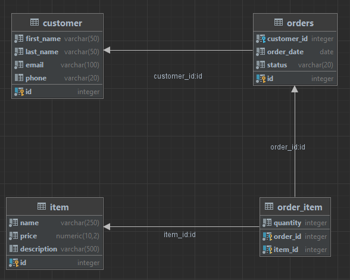

## Pour lancer le projet !

A la racine du projet, lancer la commande suivante :

```sh
docker-compose up
```

## Comment accéder à la BDD

    Sur le navigateur : http://localhost:8080

    Renseigner les informations suivantes :    

        Système : PostgreSQL
        Serveur : postgres
        Utilisateur : postgres
        Mot de passe : postgres
        Base de données : postgres

## Le modèle de données
 
 


## Les requêtes à faire `:)`
### 1: Sélectionner tous les clients.


### 2: Sélectionner tous les articles dont le prix est supérieur à 100.


### 3: Sélectionner les commandes passées par le client ayant l'ID 2.


### 4: Sélectionner les noms et les emails des clients ayant un numéro de téléphone.


### 5: Sélectionner les articles et leur quantité pour la commande ayant l'ID 3.


### 6: Sélectionner le nom, le prénom et l'email des clients ayant passé une commande avec le statut 'EN COURS'.


### 7: Sélectionner le nom des articles et la quantité totale vendue pour chaque article.


### 8: Sélectionner le nom, le prénom et le montant total dépensé par chaque client.


### 9: Sélectionner les articles vendus avec chaque commande, en incluant le nom du client, l'ID de la commande et le nom de l'article.


### 10: Sélectionner les clients n'ayant pas encore passé de commande.


### 11: Sélectionner tous les clients dont le nom de famille commence par la lettre 'D'.


### 12: Sélectionner les trois articles les moins chers.


### 13: Sélectionner les commandes passées entre le 1er février 2022 et le 28 février 2022.


### 14: Sélectionner le nombre total de commandes pour chaque statut.


### 15: Sélectionner les articles dont le nom contient le mot 'Câble'.


### 16: Sélectionner l'ID de la commande, le nom de l'article et le prix total pour chaque article commandé.


### 17: Sélectionner les clients et le nombre de commandes qu'ils ont passées, en affichant seulement les clients ayant passé au moins deux commandes.

### 18: Sélectionner les articles qui n'ont jamais été commandés.


### 19: Sélectionner les clients et le prix moyen des articles qu'ils ont commandés.


### 20: Sélectionner les commandes contenant au moins un article dont le prix est supérieur à 500.